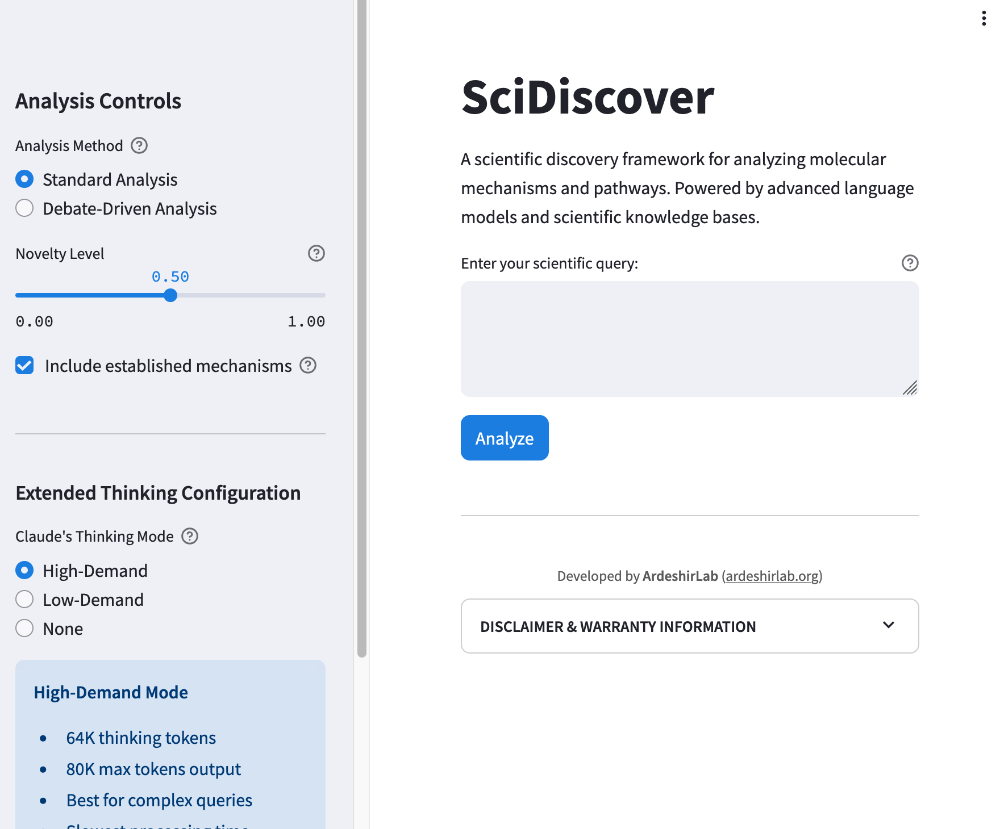

# SciDiscover

[](LICENSE)
[](https://www.python.org/downloads/)
[](https://streamlit.io/)
[](https://anthropic.com/)

## An Advanced Scientific Discovery Platform

SciDiscover is a cutting-edge platform for scientific discovery that leverages multi-agent AI reasoning to transform biomedical research through intelligent, adaptive knowledge exploration and collaborative hypothesis generation.



## Core Features

- **Multi-Agent Reasoning**: Implements a collaborative multi-agent framework with specialized agents (Scientist, Critic, Expander) for hypothesis generation, critique, and refinement
- **Dynamic Knowledge Graphs**: Visualizes and navigates complex relationships between scientific concepts using network analysis and concept path reasoning
- **Extended Thinking Capabilities**: Utilizes Claude 3.7 Sonnet with up to 64K thinking tokens for deeper scientific analysis
- **Performance Metrics**: Tracks analysis time and confidence scores for experimental validation
- **Debate-Driven Analysis**: Simulates scientific discourse through structured multi-agent debate with multiple refinement rounds

## Technologies

- **Backend**: Python with advanced LLM integration (Claude 3.7 Sonnet-20250219)
- **Frontend**: Streamlit interactive web interface with responsive visualizations
- **Data Sources**: Integration with PubTator3 for biomedical entity recognition
- **Knowledge Integration**: Custom knowledge graph construction with NetworkX

## Getting Started

### Prerequisites

- Python 3.11+
- Anthropic API key (required)
- OpenAI API key (optional, used as fallback)

### Installation

```bash
# Clone the repository
git clone https://github.com/yourusername/scidiscover.git
cd scidiscover

# Create a virtual environment (recommended)
python -m venv venv
source venv/bin/activate  # On Windows: venv\Scripts\activate

# Install dependencies for your platform
# For GitHub and most environments:
pip install -r requirements-github.txt

# For development:
pip install -r requirements_dev.txt
```

#### API Key Setup

SciDiscover requires an Anthropic API key to function properly:

1. Create an account on [Anthropic's website](https://console.anthropic.com/)
2. Generate an API key from the Anthropic console
3. Set up your API key using one of these methods:

   **Method 1: Using .env file (recommended)**
   ```bash
   cp .env.example .env
   # Edit .env file with your API key:
   # ANTHROPIC_API_KEY=your_actual_key_here
   ```

   **Method 2: Setting environment variables directly**
   ```bash
   export ANTHROPIC_API_KEY=your_anthropic_api_key
   export OPENAI_API_KEY=your_openai_api_key  # Optional
   ```

### Running the Application

```bash
streamlit run main.py
```

The application will be available at http://localhost:5000 by default.

### Docker Deployment (Optional)

A Dockerfile is provided for containerized deployment:

```bash
# Build the Docker image
docker build -t scidiscover:latest .

# Run the container
docker run -p 5000:5000 -e ANTHROPIC_API_KEY=your_key_here scidiscover:latest
```

### GitHub Codespaces

This repository is configured for GitHub Codespaces, allowing you to start developing in a fully configured environment directly in your browser:

1. Click on the "Code" button on the GitHub repository
2. Select the "Codespaces" tab
3. Click "Create codespace on main"
4. Once launched, add your API keys as secrets in the Codespaces environment

## Usage Guide

### Performing Scientific Analysis

1. Enter your scientific query in the main text area
2. Adjust the novelty level slider (0: established knowledge, 1: cutting-edge)
3. Select your preferred analysis method:
   - Standard Analysis: Direct exploration of mechanisms
   - Debate-Driven Analysis: Multi-agent collaborative reasoning
4. Choose the appropriate thinking mode based on query complexity:
   - High-Demand: 64K thinking tokens (best for complex queries)
   - Low-Demand: 32K thinking tokens (balanced)
   - None: Standard processing (fastest)
5. Click "Analyze" to initiate the discovery process

### Interpreting Results

The analysis results include:
- Key molecular pathways
- Relevant genes and their roles
- Detailed molecular mechanisms
- Temporal sequence of events
- Supporting experimental evidence
- Clinical and therapeutic implications
- Confidence score and analysis metrics

## Architecture

SciDiscover is built with a modular architecture following multi-agent AI design principles:

### Overall Architecture

- **Knowledge Layer**: Entity recognition, knowledge graph construction, PubTator3 integration
- **Reasoning Layer**: LLM-based specialized agents, hypothesis generation, validation
- **Orchestration Layer**: Workflow management, agent coordination, debate orchestration
- **User Interface**: Interactive visualization, configuration controls, progress tracking

### Multi-Agent System

SciDiscover implements a specialized multi-agent system based on the SciAgents architecture:

- **Ontologist Agent**: Defines key scientific concepts and their relationships
- **Scientist Agent**: Generates detailed scientific hypotheses based on concepts
- **Expander Agent**: Refines and expands hypotheses with additional context
- **Critic Agent**: Evaluates hypotheses for scientific validity and limitations
- **Debate Orchestrator**: Manages the multi-round debate process between agents

### Extended Thinking

The system leverages Claude's extended thinking capabilities through:

- **High Thinking Mode**: 64K thinking tokens, 80K output tokens
- **Low Thinking Mode**: 32K thinking tokens, 64K output tokens 
- **Standard Mode**: No extended thinking, 32K output tokens

## Development

### Complete Project Structure

```
scidiscover/
├── collaboration/     # Collaborative hypothesis building
│   └── gamification.py  # Scoring and rewards system
├── knowledge/         # Knowledge integration components
│   ├── graph.py         # Base knowledge graph implementation
│   ├── kg_coi.py        # KG-COI reasoning implementation
│   └── pubtator.py      # PubTator3 API integration
├── orchestrator/      # Scientific workflow coordination
│   └── workflow.py      # Main workflow orchestration
├── output/            # Output formatting utilities
│   └── formatter.py     # Format for display
├── reasoning/         # AI reasoning and hypothesis generation
│   ├── agents.py        # Specialized agent implementations
│   ├── debate_orchestrator.py  # Multi-agent debate system
│   ├── hypothesis.py    # Hypothesis generation
│   ├── kg_reasoning.py  # Graph-based reasoning
│   ├── llm_manager.py   # LLM API integration
│   └── sci_agent.py     # Main scientific agent
├── ui/                # Streamlit interface components
│   ├── components.py    # Reusable UI elements
│   └── pages.py         # Page definitions
├── config.py          # Configuration settings
└── snapshot.py        # Versioning and snapshot management
```

### Snapshot System

SciDiscover includes a sophisticated snapshot system for versioning analyses and preserving research states:

```bash
# Create a new snapshot with timestamp and metadata
python scripts/create_snapshot.py create "My Research Milestone" --description "Key findings on mechanism X"

# List all available snapshots with creation dates
python scripts/create_snapshot.py list

# Show detailed snapshot information including metadata
python scripts/create_snapshot.py show "My Research Milestone"

# Compare two snapshots to see differences
python scripts/create_snapshot.py compare "Milestone A" "Milestone B"
```

### Advanced Configuration

For advanced users, the following configuration options are available in `config.py`:

- Model selection for both Anthropic and OpenAI
- Thinking token allocation for different modes
- PubTator API endpoint configuration
- Knowledge graph cache settings

## License

This project is licensed under the Apache License 2.0. See the LICENSE file for details.

## Disclaimer

This software is provided "AS IS" without warranty of any kind. SciDiscover utilizes Large Language Models (LLMs) and PubTator, which may generate content that is incorrect, incomplete, or misleading despite best efforts to ensure accuracy.

**Important**: This software is intended to assist scientific research but should not be used as the sole basis for any scientific conclusions, medical decisions, or policy recommendations.

For the full disclaimer, please see the [DISCLAIMER.md](DISCLAIMER.md) file.

## Acknowledgments

- This research utilizes the Anthropic Claude API
- PubTator3 for biomedical entity recognition
- NetworkX for knowledge graph implementations

## Contact

For questions or collaboration opportunities, please reach out to the ArdeshirLab organization.